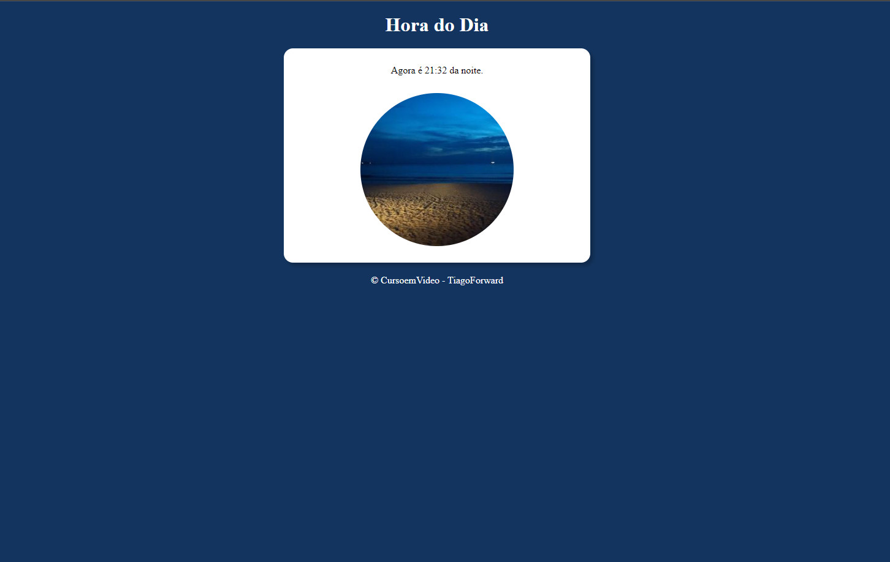
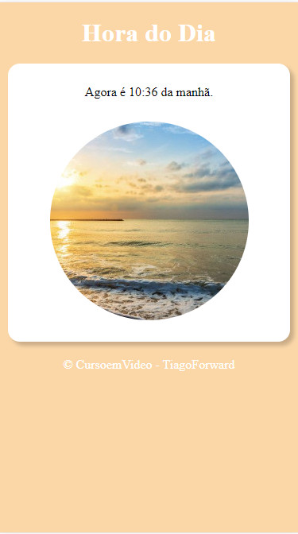

# Desafio Curso em Vídeo | Hora do dia

## Tabela do Conteudo

<ul>
<li><a href="#sobre">Sobre</a></li>
<li><a href="#status">Status</a></li>
<li><a href="#objetivo">Objetivo</a></li>
<li><a href="#curiosidade">Curiosidade</a></li>
<li><a href="#tecnologias">Tecnologias</a></li>
<li><a href="#acessando-o-site">Acessando o site</a></li>
</ul>

## Sobre

### Layout Desktop | Mobile.

## Status

Concluído! 👌

## Objetivo

Depois de concluir o módulo de JavaScript do Curso em Video, esse é o primeiro desafio proposto do curso, desenvolver um site que pudesse buscar a hora do computador, exibir cor de background e a imagem de fundo conforme o período do dia, utilizando html, css e principalmente javascript.

## Curiosidade

Para resolver esse desafio fui utilizado uma estrutura condicional aninhada, onde que em cada condição, é acrescentado um texto de exibição do horário, um style de cor de fundo e um diretório onde está localizado a imagem.

Antes de olhar qualquer resolução desse exercício, fiz minha primeira solucção básica para resolver esse problema, na qual já foi enviada anteriormente ao meu repositório do gitHub, e agora estou refatorando algumas linhas de código.

## Tecnologias

<ul>
<li>HTML</li>
<li>CSS</li>
<li>JavaScript</li>
<li>GIT BASH</li>
</ul>

## Acessando o site

Para acessar a página, por favor use esse link : <a href="https://tiago-forward.github.io/desafio-hora-do-dia/" target="_blank">Desafio Curso em Vídeo | Hora do dia</a>